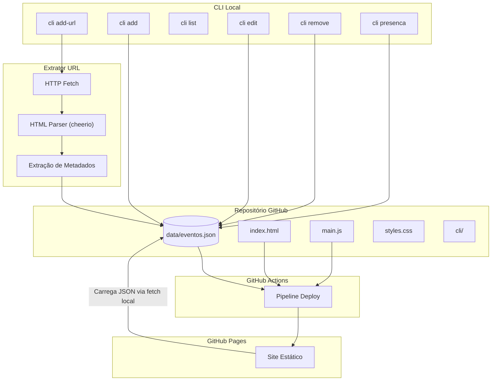
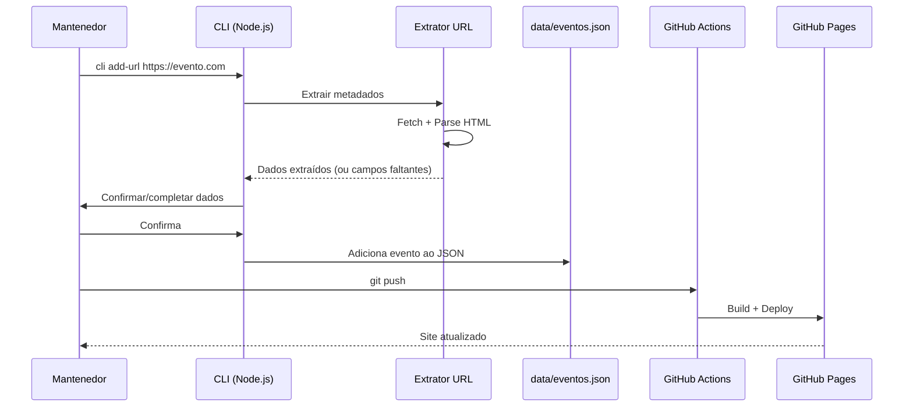

# Documento de Design — Papo de Sysadmin Eventos

## Overview

Este documento descreve o design técnico para a modernização do site de calendário de eventos, transformando-o na página oficial de eventos do "Papo de Sysadmin". A solução mantém a arquitetura de site estático hospedado no GitHub Pages, substituindo a dependência do Google Sheets por armazenamento local em JSON e adicionando automação via CLI para gerenciamento de eventos.

### Decisões Arquiteturais Principais

| Decisão | Escolha | Justificativa |
|---------|---------|---------------|
| Framework frontend | Vanilla JS + Bootstrap 5 | Mantém simplicidade do projeto original, sem build step obrigatório |
| Armazenamento de dados | JSON local no repositório | Elimina dependência externa, versionável via Git |
| CLI de gerenciamento | Node.js (Commander.js) | Ecossistema já presente no projeto, fácil de instalar |
| Extração de URL | Node.js com cheerio + fetch | Leve, sem dependências pesadas como Puppeteer |
| Deploy | GitHub Actions | Integração nativa com GitHub Pages |
| Linguagem da CLI | JavaScript/Node.js | Consistência com o frontend, sem necessidade de compilação |

## Architecture

### Diagrama de Arquitetura



### Fluxo de Dados



## Components and Interfaces

### 1. Frontend (Site Estático)

**Responsabilidade:** Renderizar a lista de eventos com filtros e destaque de presença.

**Interface pública:**
- Carrega `data/eventos.json` via `fetch()` relativo
- Renderiza cards de eventos com badge de presença
- Oferece filtros: mês, categoria, presença

**Módulos internos:**
```javascript
// main.js - Módulo principal refatorado
const EventosApp = {
  init(),              // Inicializa a aplicação
  loadEvents(),        // Carrega JSON local
  renderEvents(events), // Renderiza lista de eventos
  applyFilters(),      // Aplica filtros combinados
  sortEvents(events),  // Ordena por data + presença
}
```

### 2. CLI de Gerenciamento (Painel_Admin)

**Responsabilidade:** Gerenciar eventos via linha de comando.

**Interface pública (comandos):**
```
eventos add-url <url>       # Adiciona evento via URL
eventos add                 # Adiciona evento manualmente
eventos list [--presenca]   # Lista eventos
eventos edit <id>           # Edita evento por ID
eventos remove <id>        # Remove evento por ID
eventos presenca <id> <tipo> # Define presença
```

**Módulos internos:**
```javascript
// cli/index.js
const { Command } = require('commander');

// cli/commands/add-url.js
async function addFromUrl(url) { /* ... */ }

// cli/commands/add.js
async function addManual() { /* ... */ }

// cli/commands/list.js
function listEvents(options) { /* ... */ }

// cli/commands/edit.js
async function editEvent(id) { /* ... */ }

// cli/commands/remove.js
async function removeEvent(id) { /* ... */ }

// cli/commands/presenca.js
async function setPresenca(id, tipo) { /* ... */ }
```

### 3. Extrator de URL (Extrator_URL)

**Responsabilidade:** Acessar URL de evento e extrair metadados estruturados.

**Interface pública:**
```javascript
// cli/extractor/index.js

/**
 * Extrai metadados de evento a partir de uma URL
 * @param {string} url - URL da página do evento
 * @returns {Promise<ExtractionResult>}
 */
async function extractEventFromUrl(url) { /* ... */ }

/**
 * @typedef {Object} ExtractionResult
 * @property {boolean} success
 * @property {Partial<EventData>} data - Dados extraídos
 * @property {string[]} missingFields - Campos obrigatórios não encontrados
 * @property {string} [error] - Mensagem de erro se falhou
 */
```

**Estratégia de extração (em ordem de prioridade):**
1. JSON-LD (`<script type="application/ld+json">`) — schema.org/Event
2. Microdata/RDFa (itemprop)
3. Open Graph meta tags (og:title, event:start_time, etc.)
4. Heurísticas de HTML (h1, datas no texto, endereços)

### 4. Validador de Dados

**Responsabilidade:** Validar estrutura e conteúdo do JSON de eventos.

**Interface pública:**
```javascript
// cli/validator/index.js

/**
 * Valida um objeto de evento contra o schema
 * @param {object} event - Objeto de evento a validar
 * @returns {ValidationResult}
 */
function validateEvent(event) { /* ... */ }

/**
 * Valida o arquivo completo de eventos
 * @param {object[]} events - Array de eventos
 * @returns {ValidationResult}
 */
function validateEventsFile(events) { /* ... */ }

/**
 * @typedef {Object} ValidationResult
 * @property {boolean} valid
 * @property {string[]} errors - Lista de erros encontrados
 */
```

### 5. Pipeline de Deploy (GitHub Actions)

**Responsabilidade:** Build e deploy automático ao GitHub Pages.

**Interface:**
- Trigger: push na branch principal com alterações em `data/eventos.json` ou arquivos do site
- Output: site publicado no GitHub Pages
- Status: success/failure no commit

## Data Models

### Schema do Evento

```json
{
  "$schema": "http://json-schema.org/draft-07/schema#",
  "type": "object",
  "required": ["id", "nome", "dataInicio", "local", "cidade", "estado", "pais", "url", "categoria"],
  "properties": {
    "id": {
      "type": "string",
      "description": "Identificador único (UUID v4)"
    },
    "nome": {
      "type": "string",
      "minLength": 1,
      "description": "Nome do evento"
    },
    "dataInicio": {
      "type": "string",
      "format": "date",
      "description": "Data de início no formato ISO 8601 (YYYY-MM-DD)"
    },
    "dataFim": {
      "type": "string",
      "format": "date",
      "description": "Data de fim no formato ISO 8601 (YYYY-MM-DD), opcional"
    },
    "local": {
      "type": "string",
      "minLength": 1,
      "description": "Nome do local/venue"
    },
    "cidade": {
      "type": "string",
      "minLength": 1
    },
    "estado": {
      "type": "string",
      "minLength": 1
    },
    "pais": {
      "type": "string",
      "minLength": 1
    },
    "url": {
      "type": "string",
      "format": "uri",
      "description": "URL do site oficial do evento"
    },
    "categoria": {
      "type": "string",
      "enum": ["Cloud", "DevOps", "Seguranca", "Infraestrutura", "Automacao", "Observabilidade", "Containers", "Linux", "Redes", "Geral", "IA", "Desenvolvimento", "Dados", "Carreira"]
    },
    "descricao": {
      "type": "string",
      "maxLength": 200,
      "description": "Descrição curta do evento (opcional)"
    },
    "presenca": {
      "type": "object",
      "description": "Presença do Papo de Sysadmin (opcional, null se ausente)",
      "properties": {
        "confirmada": {
          "type": "boolean"
        },
        "tipo": {
          "type": "string",
          "enum": ["palestrante", "participante", "organizador", "midia"]
        }
      },
      "required": ["confirmada", "tipo"]
    }
  }
}
```

### Estrutura do Arquivo `data/eventos.json`

```json
[
  {
    "id": "a1b2c3d4-e5f6-7890-abcd-ef1234567890",
    "nome": "KubeCon South America 2026",
    "dataInicio": "2026-03-15",
    "dataFim": "2026-03-17",
    "local": "Centro de Convenções",
    "cidade": "São Paulo",
    "estado": "SP",
    "pais": "Brasil",
    "url": "https://kubecon.io",
    "categoria": "Containers",
    "descricao": "Maior evento de Kubernetes da América do Sul",
    "presenca": {
      "confirmada": true,
      "tipo": "palestrante"
    }
  }
]
```

### Categorias do Sistema

As categorias foram atualizadas para refletir o foco em infraestrutura e sysadmin:

| Categoria | Cor | Descrição |
|-----------|-----|-----------|
| Cloud | #e34000 | Eventos de cloud computing |
| DevOps | #0da58d | Cultura e práticas DevOps |
| Seguranca | #7ec26b | Segurança da informação |
| Infraestrutura | #283ee0 | Infraestrutura de TI |
| Automacao | #bfa719 | Automação e IaC |
| Observabilidade | #8d73aa | Monitoramento e observabilidade |
| Containers | #18b1fc | Docker, Kubernetes, etc. |
| Linux | #613176 | Sistemas Linux |
| Redes | #5a83de | Networking |
| Geral | #a14360 | Eventos gerais de tecnologia |
| IA | #d02a15 | Inteligência Artificial |
| Desenvolvimento | #f49715 | Desenvolvimento de software |
| Dados | #3b987d | Engenharia de dados |
| Carreira | #e90f95 | Carreira e liderança |

### Estrutura de Diretórios do Projeto (Proposta)

```
eventos/
├── index.html              # Página principal
├── styles.css              # Estilos customizados
├── main.js                 # Lógica do frontend
├── data/
│   └── eventos.json        # Dados dos eventos
├── assets/
│   ├── logo-papo.svg       # Logo do Papo de Sysadmin
│   └── icons/              # Ícones de redes sociais
├── cli/
│   ├── package.json        # Dependências da CLI
│   ├── index.js            # Entry point da CLI
│   ├── commands/           # Comandos da CLI
│   │   ├── add-url.js
│   │   ├── add.js
│   │   ├── edit.js
│   │   ├── list.js
│   │   ├── remove.js
│   │   └── presenca.js
│   ├── extractor/          # Módulo de extração de URL
│   │   ├── index.js
│   │   ├── strategies/     # Estratégias de extração
│   │   │   ├── json-ld.js
│   │   │   ├── microdata.js
│   │   │   ├── opengraph.js
│   │   │   └── heuristic.js
│   │   └── normalizer.js   # Normalização de dados extraídos
│   ├── validator/          # Validação de dados
│   │   └── index.js
│   └── utils/
│       └── json-io.js      # Leitura/escrita do arquivo JSON
├── .github/
│   └── workflows/
│       └── deploy.yml      # Pipeline de deploy
└── README.md
```

## Correctness Properties

*Uma propriedade é uma característica ou comportamento que deve ser verdadeiro em todas as execuções válidas de um sistema — essencialmente, uma declaração formal sobre o que o sistema deve fazer. Propriedades servem como ponte entre especificações legíveis por humanos e garantias de corretude verificáveis por máquina.*

### Property 1: Round-trip de serialização JSON de eventos

*Para qualquer* array válido de objetos de evento, serializar para JSON e depois fazer parsing de volta deve produzir um array equivalente ao original, preservando todos os campos e valores.

**Validates: Requirements 2.3, 3.7**

### Property 2: Validação de eventos aceita válidos e rejeita inválidos

*Para qualquer* objeto de evento gerado aleatoriamente, se todos os campos obrigatórios (nome, dataInicio, local, cidade, estado, pais, url, categoria) estiverem presentes e com formatos válidos, o validador deve aceitar o evento; se qualquer campo obrigatório estiver ausente ou com formato inválido, o validador deve rejeitar o evento e reportar exatamente quais campos estão faltando ou inválidos.

**Validates: Requirements 2.2, 7.7, 7.8**

### Property 3: Saída do extrator conforma ao schema de eventos

*Para qualquer* página HTML contendo metadados de evento (em JSON-LD, microdata ou Open Graph), quando o extrator concluir com sucesso, a saída gerada deve ser um objeto JSON válido que passa na validação do schema do Arquivo_Eventos.

**Validates: Requirements 3.2**

### Property 4: Extrator identifica campos faltantes corretamente

*Para qualquer* página HTML com subconjunto aleatório de campos de evento presentes, o extrator deve reportar exatamente os campos obrigatórios que não foram encontrados na página, sem falsos positivos nem falsos negativos.

**Validates: Requirements 3.3, 2.4**

### Property 5: Extrator rejeita páginas sem dados de evento

*Para qualquer* página HTML que não contenha ao menos um nome e uma data de início identificáveis, o extrator deve reportar falha indicando que não foi possível reconhecer dados de evento.

**Validates: Requirements 3.6**

### Property 6: Badge de presença renderiza corretamente

*Para qualquer* evento com presença confirmada (presenca.confirmada = true), o sistema deve renderizar o Badge_Presenca com o texto do Tipo_Presenca correspondente (palestrante, participante, organizador ou mídia); e para qualquer evento sem presença confirmada, o badge não deve ser renderizado.

**Validates: Requirements 4.1, 4.2**

### Property 7: Ordenação de eventos por data e presença

*Para qualquer* lista de eventos, após a ordenação, a sequência deve satisfazer: (a) eventos com dataInicio anterior aparecem antes de eventos com dataInicio posterior, e (b) entre eventos com a mesma dataInicio, eventos com presenca.confirmada = true aparecem antes dos demais.

**Validates: Requirements 4.3**

### Property 8: Filtros combinados aplicam lógica AND

*Para qualquer* conjunto de eventos e qualquer combinação de filtros ativos (mês, categoria, presença), os eventos exibidos devem ser exatamente aqueles que satisfazem TODOS os critérios simultaneamente — ou seja, a interseção dos conjuntos filtrados individualmente.

**Validates: Requirements 4.4, 4.5, 5.4**

### Property 9: Contador de presença é preciso

*Para qualquer* conjunto de eventos, o contador exibido junto ao filtro "Presença Papo de Sysadmin" deve ser igual ao número de eventos onde presenca.confirmada = true.

**Validates: Requirements 4.6**

### Property 10: Contador de resultados filtrados é preciso

*Para qualquer* conjunto de eventos e qualquer combinação de filtros aplicados, o número total exibido acima da lista deve ser igual ao número real de eventos que satisfazem todos os filtros ativos.

**Validates: Requirements 5.5**

### Property 11: Edição de evento preserva campos não modificados

*Para qualquer* evento existente e qualquer campo individual sendo editado, após a edição, todos os outros campos do evento devem permanecer inalterados.

**Validates: Requirements 7.4**

### Property 12: Remoção de evento diminui a lista

*Para qualquer* lista de eventos com pelo menos um evento, remover um evento por ID válido deve resultar em uma lista com exatamente um evento a menos, e o evento removido não deve mais estar presente.

**Validates: Requirements 7.5**

### Property 13: Listagem CLI exibe todos os eventos

*Para qualquer* conjunto de eventos no Arquivo_Eventos, o comando de listagem deve exibir na saída o identificador, nome, data de início e status de presença de cada evento, sem omissões.

**Validates: Requirements 7.3**

## Error Handling

### Erros no Frontend

| Cenário | Comportamento | Mensagem ao Usuário |
|---------|---------------|---------------------|
| JSON malformado em `data/eventos.json` | Captura erro de parsing, exibe mensagem | "Erro ao carregar eventos: formato de dados inválido." |
| Arquivo JSON vazio (array `[]`) | Renderiza estado vazio | "Nenhum evento disponível no momento." |
| Falha no fetch do arquivo JSON | Captura erro de rede/404 | "Não foi possível carregar os eventos. Verifique sua conexão." |
| Filtros sem resultados | Renderiza estado vazio filtrado | "Nenhum evento encontrado para os filtros selecionados." |
| Logo não carrega | Evento `onerror` na imagem | Exibe texto "Papo de Sysadmin" como fallback |

### Erros na CLI

| Cenário | Comportamento | Mensagem ao Usuário |
|---------|---------------|---------------------|
| URL não responde (timeout 30s) | Aborta fetch, informa erro | "Erro: URL não respondeu em 30 segundos. Tente outra URL." |
| URL retorna erro HTTP (4xx/5xx) | Informa código e motivo | "Erro HTTP {código}: {motivo}. Tente outra URL." |
| Página sem dados de evento | Informa falha na extração | "Não foi possível identificar dados de evento nesta página." |
| Campos obrigatórios faltando na extração | Lista campos faltantes | "Campos não encontrados: {lista}. Preencha manualmente:" |
| ID de evento não encontrado | Informa inexistência | "Evento com ID '{id}' não encontrado." |
| Validação falha ao salvar | Lista campos inválidos | "Não foi possível salvar. Campos inválidos: {lista}" |
| Arquivo JSON corrompido | Informa e sugere ação | "Erro: data/eventos.json está corrompido. Verifique o arquivo." |

### Erros no Pipeline

| Cenário | Comportamento |
|---------|---------------|
| Build falha | Marca commit como "failure", logs disponíveis no GitHub Actions |
| Deploy falha | Marca commit como "failure", logs disponíveis no GitHub Actions |
| Timeout (>5 min) | Cancela execução, marca commit como "failure" |

## Testing Strategy

### Abordagem Dual: Testes Unitários + Testes de Propriedade

A estratégia de testes combina testes unitários (exemplos específicos e edge cases) com testes de propriedade (verificação universal via inputs aleatórios).

### Biblioteca de Testes de Propriedade

- **Framework de testes:** Jest
- **Biblioteca PBT:** fast-check
- **Mínimo de iterações:** 100 por teste de propriedade

### Testes de Propriedade (Property-Based Tests)

Cada propriedade do documento de design será implementada como um teste de propriedade individual usando `fast-check`:

| Propriedade | Módulo Testado | Gerador Principal |
|-------------|----------------|-------------------|
| Property 1: Round-trip JSON | `cli/utils/json-io.js` | `fc.array(arbitraryEvent())` |
| Property 2: Validação | `cli/validator/index.js` | `arbitraryEvent()` + `arbitraryInvalidEvent()` |
| Property 3: Schema do extrator | `cli/extractor/index.js` | `arbitraryEventHtml()` |
| Property 4: Campos faltantes | `cli/extractor/index.js` | `arbitraryPartialHtml()` |
| Property 5: Rejeição de não-eventos | `cli/extractor/index.js` | `arbitraryNonEventHtml()` |
| Property 6: Badge de presença | `main.js` (renderização) | `arbitraryEvent()` com/sem presença |
| Property 7: Ordenação | `main.js` (sort) | `fc.array(arbitraryEvent())` |
| Property 8: Filtros AND | `main.js` (filtros) | `fc.array(arbitraryEvent())` + `arbitraryFilters()` |
| Property 9: Contador presença | `main.js` (contagem) | `fc.array(arbitraryEvent())` |
| Property 10: Contador filtrados | `main.js` (contagem) | `fc.array(arbitraryEvent())` + `arbitraryFilters()` |
| Property 11: Edição preserva | `cli/commands/edit.js` | `arbitraryEvent()` + `arbitraryFieldEdit()` |
| Property 12: Remoção diminui | `cli/commands/remove.js` | `fc.array(arbitraryEvent(), {minLength: 1})` |
| Property 13: Listagem completa | `cli/commands/list.js` | `fc.array(arbitraryEvent())` |

**Configuração dos testes de propriedade:**
- Cada teste deve rodar no mínimo 100 iterações
- Cada teste deve conter um comentário referenciando a propriedade do design
- Formato do tag: **Feature: papo-sysadmin-eventos, Property {número}: {texto da propriedade}**

### Testes Unitários (Example-Based)

| Área | Exemplos a Testar |
|------|-------------------|
| Rebranding (Req 1) | Logo presente com alt text, links sociais com aria-label, título correto, meta tags OG/Twitter |
| Carregamento JSON (Req 2) | Carrega arquivo válido, exibe erro para JSON malformado, exibe mensagem para array vazio |
| Extração URL (Req 3) | Extrai de JSON-LD, extrai de Open Graph, timeout de 30s, erro HTTP |
| Filtros (Req 5) | Dropdown de meses com 13 opções, categorias na sidebar, reset de filtros |
| CLI (Req 7) | Adiciona evento manual, ID não encontrado retorna erro |
| Responsividade (Req 8) | Layout mobile vs desktop, tamanho de fonte, área de toque |

### Testes de Integração

| Cenário | Escopo |
|---------|--------|
| Pipeline de deploy | Push → build → deploy → site atualizado |
| CLI end-to-end | add-url → extração → validação → salva JSON |
| Frontend com dados reais | Carrega JSON → renderiza → filtra → ordena |

### Testes de Acessibilidade

- Auditoria com axe-core para WCAG 2.1 AA
- Verificação de contraste 4.5:1
- Verificação de área de toque 44x44px em mobile
- Verificação de aria-labels em links e botões

### Estrutura de Testes

```
cli/
├── __tests__/
│   ├── properties/           # Testes de propriedade
│   │   ├── json-roundtrip.test.js
│   │   ├── validator.test.js
│   │   ├── extractor.test.js
│   │   ├── sorting.test.js
│   │   ├── filters.test.js
│   │   └── cli-commands.test.js
│   ├── unit/                 # Testes unitários
│   │   ├── validator.test.js
│   │   ├── extractor.test.js
│   │   └── commands.test.js
│   └── integration/          # Testes de integração
│       └── cli-flow.test.js
```

